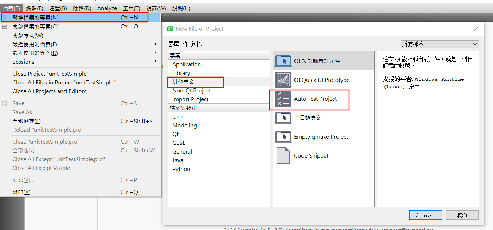
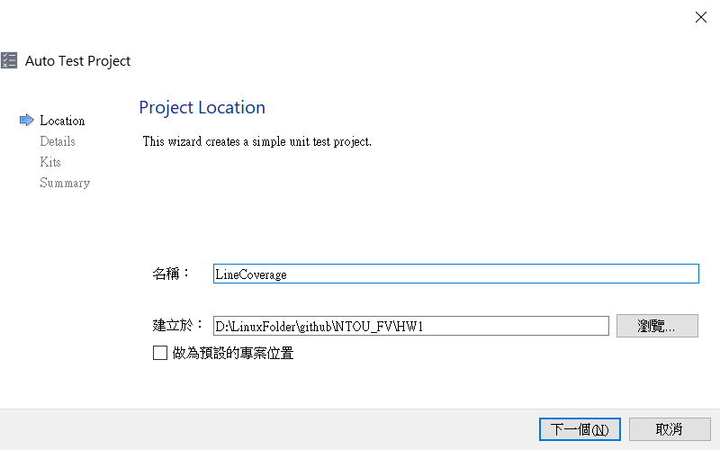
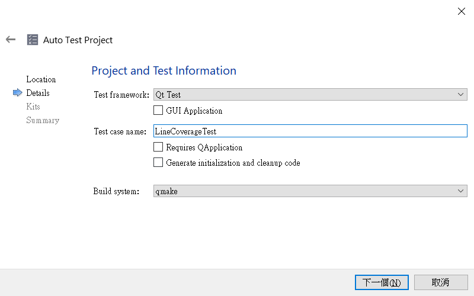
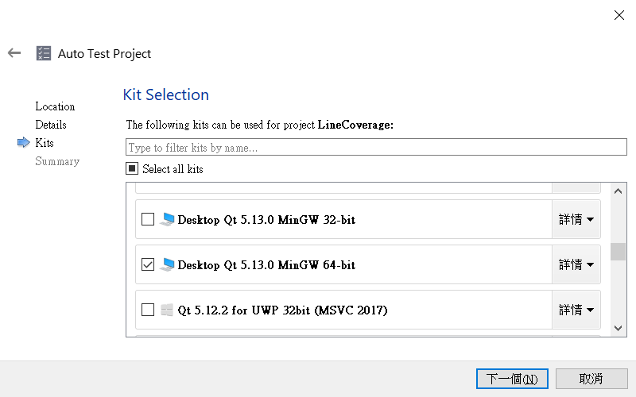
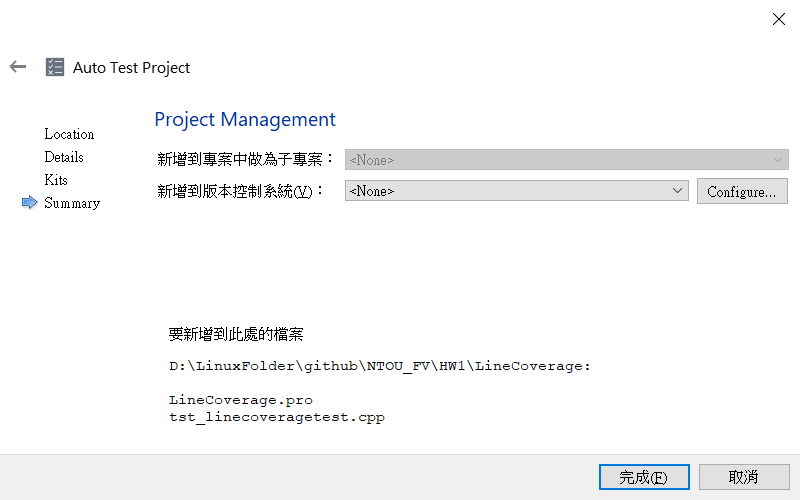
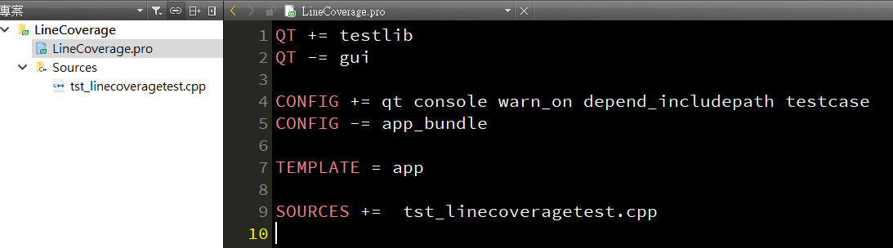
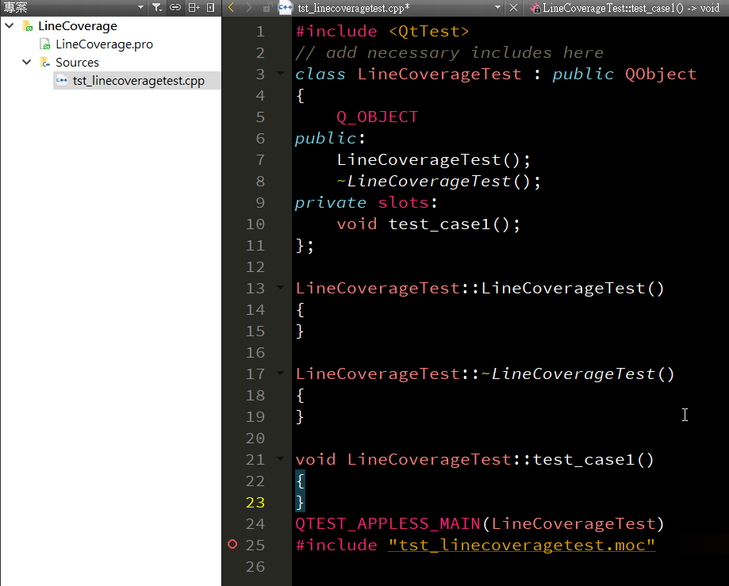
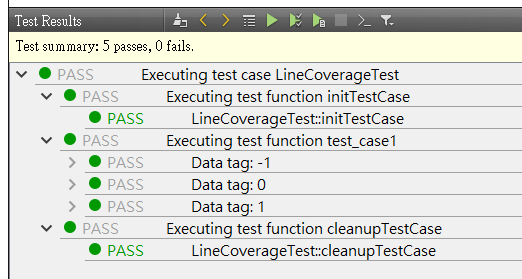

<H2> HW1: Line Converage </H2>
[TOC]

---
## A: Create a project with QT
### 1. Create a project


### 2. Project name and folder path
2.1. 名稱: 目錄名
2.2. 建立於: 指定的路徑 



### 3. Test case name (Class name)
指定Class 類別名稱


### 4. Kit Select 
選擇編譯的工具


### 5. Finish


---
## B: Project and source code
**A 部分執行完，會產生template 如下:**





---
## C: Sample code for unit test.
### 1. Source code
```c {.line-numbers}
#include <QtTest>
// add necessary includes here

class LineCoverageTest : public QObject
{
    Q_OBJECT

    /**
     * @brief isGreatThanZero
     *  Used to be an unit test API.
     * @param i [IN]
     * @return true if i>=0, otherwise false
     */
    bool isGreatThanZero(int i);

public:
    LineCoverageTest();
    ~LineCoverageTest();

private slots:
    /**
     * @brief test_case1_data
     * fill the test pattern for test_case1.
     */
    void test_case1_data();

    /**
     * @brief test_case1
     * The test data has two elements, bool except and result
     * To fetch these values in the actual test
     */
    void test_case1();

};


bool LineCoverageTest::isGreatThanZero(int i)
{
    if(i>=0)
        return true;
    else
        return false;
}


LineCoverageTest::LineCoverageTest()
{
}


LineCoverageTest::~LineCoverageTest()
{
}


void LineCoverageTest::test_case1_data()
{
    QTest::addColumn<bool>("except");
    QTest::addColumn<bool>("result");

    bool result = true;
    for(int i=-1; i<2; ++i){
        if(i<0)
            result = false;
        else result = true;
        QTest::newRow(QString::number(i).toStdString().c_str()) << isGreatThanZero(i) << result;
    }
}


void LineCoverageTest::test_case1()
{
    /**
     * @brief QFETCH
     * This macro can only be used in a test function that is invoked by the test framework.
     * The test function must have a _data function.
     */
    QFETCH(bool, except);
    QFETCH(bool, result);

    QCOMPARE(except, result);
}

QTEST_APPLESS_MAIN(LineCoverageTest)

#include "tst_linecoveragetest.moc"

``` 
我們要測試的API 是 bool isGreatThanZero(int i);
採用了QT QTest 的framework 實作unit test.
[參考連結](https://doc.qt.io/qt-5/qtest.html)

### 2. Result
```sh
20:03:47: Starting D:\LinuxFolder\github\NTOU_FV\HW1\build-LineCoverage-Desktop_Qt_5_13_0_MinGW_64_bit-Debug\debug\LineCoverage.exe ...
********* Start testing of LineCoverageTest *********
Config: Using QtTest library 5.13.0, Qt 5.13.0 (x86_64-little_endian-llp64 shared (dynamic) debug build; by GCC 7.3.0)
PASS   : LineCoverageTest::initTestCase()
PASS   : LineCoverageTest::test_case1(-1)
PASS   : LineCoverageTest::test_case1(0)
PASS   : LineCoverageTest::test_case1(1)
PASS   : LineCoverageTest::cleanupTestCase()
Totals: 5 passed, 0 failed, 0 skipped, 0 blacklisted, 1ms
********* Finished testing of LineCoverageTest *********
20:03:47: D:/LinuxFolder/github/NTOU_FV/HW1/build-LineCoverage-Desktop_Qt_5_13_0_MinGW_64_bit-Debug/debug/LineCoverage.exe exited with code 0
```



