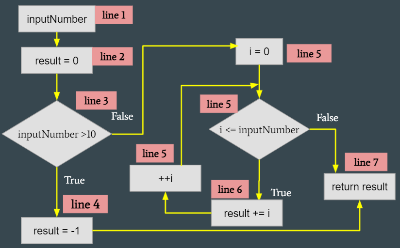
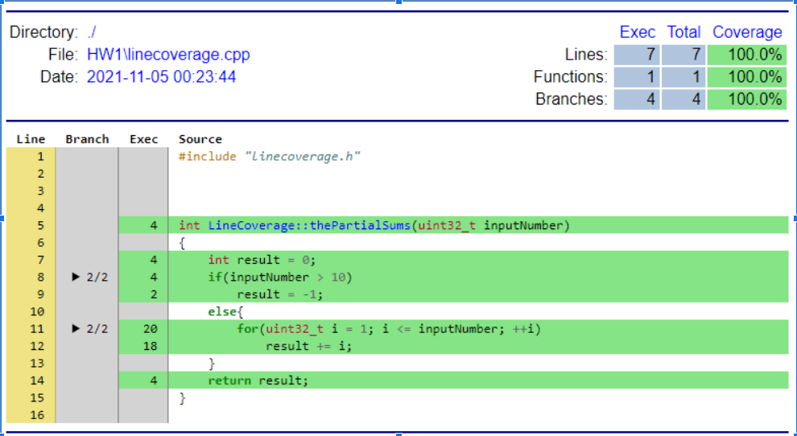

<h1>HW1: Line Coverage </h1> 	

---
[TOC]
---

## 1. Sample Code
```c {.line-numbers}
int LineCoverage::thePartialSums(uint32_t inputNumber) // 1
{
    int result = 0; // 2
    if(inputNumber > 10) // 3
        result = -1; // 4
    else{  
        for(uint32_t i = 1; i <= inputNumber; ++i) // 5
            result += i; // 6
    }
    return result; // 7
}
```

---
## 2. Flow Chart 


---

## 3. Result of the testing.
#### 3-1. Test Cases
```c {.line-numbers}
void Testing::HW1_test_data()
{
    QTest::addColumn<int>("result");
    QTest::addColumn<int>("except");

    LineCoverage lineCoverage;
    uint32_t test[2] = {17,9};
    int excepts[2] = {-1,45};

    for(int i=0; i<2; ++i){
        QTest::newRow(QString::number(test[i]).toStdString().c_str())
                << lineCoverage.thePartialSums(test[i]) ///< here
                << excepts[i];
    }
}

void Testing::HW1_test()
{
    QFETCH(int, result);
    QFETCH(int, except);

    QCOMPARE(result, except);
}
```

#### 3-2. Result of the test cases.
```sh {.line-numbers}
PASS   : Testing::HW1_test(17)
PASS   : Testing::HW1_test(9)
```
--- 

## 4. Report of Test cases.


#### **LineCoverage Test-case 1:**
> 1) Input values:  17
> 2) expected result: -1
> 3) test program's result: -1
> 4) Line coverage:  {1,2,3,4,7}


#### **LineCoverage Test-case 2:**
> 1) Input values:  9
> 2) expected result: 45
> 3) test program's result: 45
> 4) Line coverage:  {1,2,3,5,6,7}

---

## 5. Coverage Report

---