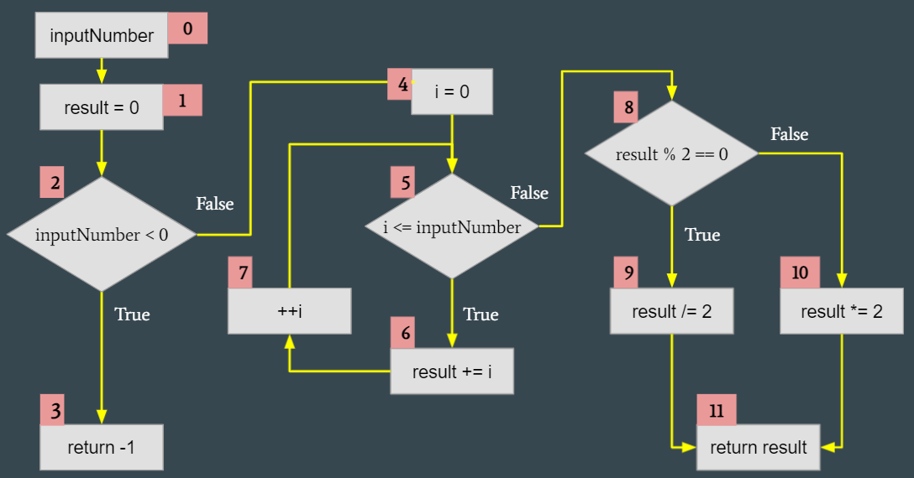
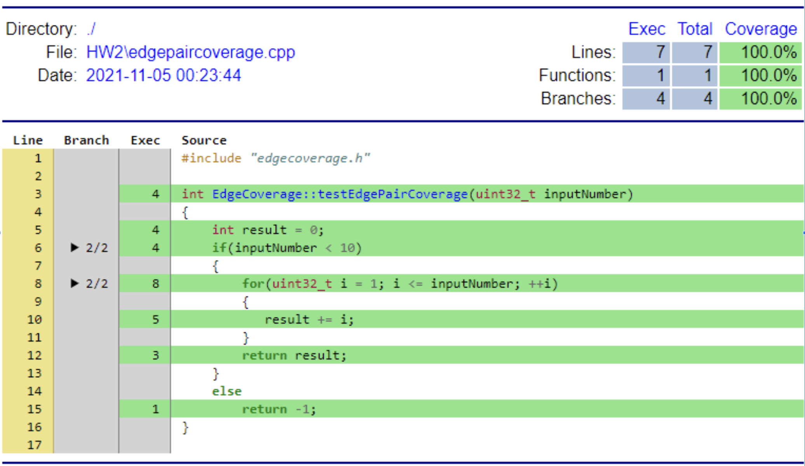

# GraphCoverage

### Sample Code
```c++  {.line-numbers}
int EdgeCoverage::testLoop(int inputNumber) //0
{
    int result = 0; //1
    if(inputNumber<0) //2
        return -1; //3
    else{     // 4      5                 7
        for(int i = 0; i <= inputNumber; ++i)
        {
            result += i; //6
        }
        if( result % 2 == 0) //8
            result /= 2; //9
        else
            result *= 2; //10
    }
    return result; //11
}
```

### Flow Chart


### Coverage Report


### Test-Case
```c++  {.line-numbers}
void Testing::HW2_test_data()
{
    QTest::addColumn<int>("result");
    QTest::addColumn<int>("except");

    EdgeCoverage edgeCoverage;
    int test[3] = {-3,0,5};
    int excepts[3] = {-1,0,30};  /// sum = 1+2+...+n, if(sum%2) sum /= 2; else sum *= 2

    for(int i=0; i<3; ++i){
        QString description = QString("HW2(edgeCoverage) Input = %1, Excepted = %2").arg(test[i]).arg(excepts[i]);
        QTest::newRow(description.toStdString().c_str())
                << edgeCoverage.testLoop(test[i])
                << excepts[i];
    }
}

void Testing::HW2_test()
{
    QFETCH(int, except);
    QFETCH(int, result);

    QCOMPARE(except, result);
}
```
### Test Results
```
PASS   : Testing::HW2_test(HW2(edgeCoverage) Input = -3, Excepted = -1)
PASS   : Testing::HW2_test(HW2(edgeCoverage) Input = 0, Excepted = 0)
PASS   : Testing::HW2_test(HW2(edgeCoverage) Input = 5, Excepted = 30)
```
### Edge Coverage
 
* test case 1
    >1. Input values: inputNumber "-3" 
    >2. Expected result: "-1"
    >3. Test program's result: "-1"
    >4. Edge Coverage: (0,1), (1,2), (2,3)
* test case2
    >1. Input values: inputNumber "0" 
    >2. EXpected result: "0"
    >3. Test program's result: "0"
    >4. Edge Coverage: (0,1),(1,2),(2,4),(4,5),
                        (5,6),(6,7),(7,5),(5,8),(8,9),(9,11)
*  test case3
    >1. Input values: inputNumber "5" 
    >2. EXpected result: "30"
    >3. Test program's result: "30"
    >4. Edge Coverage: (0,1),(1,2),(2,3),(2,4),(4,5),(5,6),
                    (6,7),(7,5),(5,8),(8,9),(8,10),(9,11),(10,11)

### Test Path Coverage
* test case 1
    >1. Input values: inputNumber "17"
    >2. Expecteㄒd result: "-1"
    >3. Test program's result: "-1"
    >4. Test Path Coverage: 1->9(1,2,3,9)
* test case 2
    >1. Input values: inputNumber "0"
    >2. Expected result: "0"
    >3. Test program's result: "0"
    >4. Test Path Coverage: 1->8(1,2,3,4,5,8)	//no loop
* test case 3
    >1. Input values: inputNumber "2"
    >2. Expected result: "3"
    >3. Test program's result: "3"
    >4. Test Path Coverage: 1->8(1,2,3,4,5,7,6,5,7,6,5,8)	//loop
