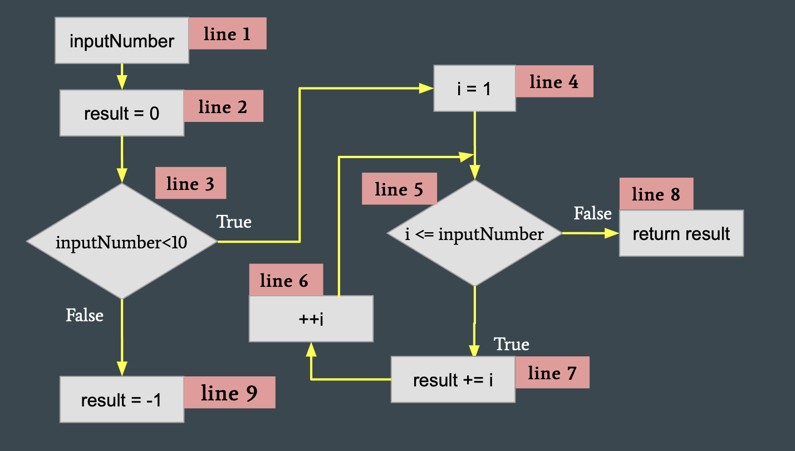

<H1>HW2: Pair/Path Coverage </H1>
[TOC]
---
## 1. Sample Code
```c++
int EdgeCoverage::testEdgePairCoverage(uint32_t inputNumber)	//1
{
    int result = 0;		//2
    if(inputNumber < 10)	//3
    {
        for(uint32_t i = 1; i <= inputNumber; ++i)
        {		//4		//5		//6
           result += i;		//7
        }
        return result;		//8
    }
    else
        return -1;		//9
}
```
--- 
## 2. Flow Chart


--- 

## 3. Result of the testing.
#### 3-1. Test Cases
```c {.line-numbers}
void FormalVerification::test_case22_data()
{
    QTest::addColumn<int>("result");
    QTest::addColumn<int>("except");

    EdgeCoverage edgeCoverage;
    uint32_t test[3] = {17,0,2};
    int excepts[3] = {-1,0,3};

    for(int i=0; i<3; ++i){
        QTest::newRow(QString::number(test[i]).toStdString().c_str())
                << edgeCoverage.testEdgePairCoverage(test[i])
                << excepts[i];
    }
}

void FormalVerification::test_case22()
{
    QFETCH(int, except);
    QFETCH(int, result);

    QCOMPARE(except, result);
}
```

#### 3-2. Result of the test cases.
```sh
PASS   : FormalVerification::test_case22(17)
PASS   : FormalVerification::test_case22(0)
PASS   : FormalVerification::test_case22(2)
```
--- 
## 4. Report of Test cases.
### 4-1. Edge-Pair Coverage
   
#### **PairCoverage Test-case 1:**
    >1. Input values: inputNumber "17" 
    >2. Expected result: "-1"
    >3. Test program's result: "-1"
    >4. Edge-Pair Coverage: (1,2,3),(2,3,9)
#### **PairCoverage Test-case 2:**
    >1. Input values: inputNumber "0" 
    >2. EXpected result: "0"
    >3. Test program's result: "0"
    >4. Edge-Pair Coverage: ~~(1,2,3)~~,(2,3,4),(3,4,5),(4,5,8)
#### **PairCoverage Test-case 3:**
    >1. Input values: inputNumber "2" 
    >2. EXpected result: "3"
    >3. Test program's result: "3"
    >4. Edge-Pair Coverage: ~~(1,2,3)~~,~~(2,3,4)~~,~~(3,4,5)~~,(4,5,7),(5,7,6),(7,6,5),(6,5,7),~~(5,7,6)~~,~~(7,6,5)~~,(6,5,8)

### 4-2. Test Path Coverage
#### **PathCoverage Test-case 1:**
    >1. Input values: inputNumber "17"
    >2. Expecteㄒd result: "-1"
    >3. Test program's result: "-1"
    >4. Test Path Coverage: 1->9(1,2,3,9)
#### **PathCoverage Test-case 2:**
    >1. Input values: inputNumber "0"
    >2. Expected result: "0"
    >3. Test program's result: "0"
    >4. Test Path Coverage: 1->8(1,2,3,4,5,8)	//no loop
#### **PathCoverage Test-case 3:**
    >1. Input values: inputNumber "2"
    >2. Expected result: "3"
    >3. Test program's result: "3"
    >4. Test Path Coverage: 1->8(1,2,3,4,5,7,6,5,7,6,5,8)	//loop

---

## 5. Coverage Report


