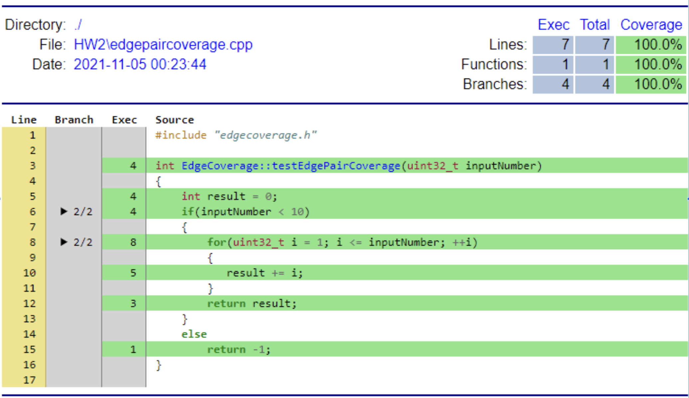

# GraphCoverage

### Sample Code
```c++
int EdgeCoverage::testEdgePairCoverage(uint32_t inputNumber)	//1
{
    int result = 0;		//2
    if(inputNumber < 10)	//3
    {
        for(uint32_t i = 1; i <= inputNumber; ++i)
        {		//4		//5		//6
           result += i;		//7
        }
        return result;		//8
    }
    else
        return -1;		//9
}
```

### Flow Chart


### Coverage Report


### Test-Case
```c++
void FormalVerification::test_case22_data()
{
    QTest::addColumn<int>("result");
    QTest::addColumn<int>("except");

    EdgeCoverage edgeCoverage;
    uint32_t test[3] = {17,0,2};
    int excepts[3] = {-1,0,3};

    for(int i=0; i<3; ++i){
        QTest::newRow(QString::number(test[i]).toStdString().c_str())
                << edgeCoverage.testEdgePairCoverage(test[i])
                << excepts[i];
    }
}

void FormalVerification::test_case22()
{
    QFETCH(int, except);
    QFETCH(int, result);

    QCOMPARE(except, result);
}
```
### Test Results
>********* Start testing of FormalVerification *********
Config: Using QtTest library 5.9.5, Qt 5.9.5 (x86_64-little_endian-lp64 shared (dynamic) release build; by GCC 7.5.0)
PASS   : FormalVerification::test_case22(17)
PASS   : FormalVerification::test_case22(0)
PASS   : FormalVerification::test_case22(2)
PASS   : FormalVerification::cleanupTestCase()
Totals: 4 passed, 0 failed, 0 skipped, 0 blacklisted, 1ms
********* Finished testing of FormalVerification *********

### Edge-Pair Coverage
* Edge-Pair
> (1,2,3),(2,3,4)(2,3,9),(3,4,5),(4,5,6),(4,5,8),(5,6,7),(6,7,5),(7,5,6),(7,5,8)    
* test case 1
    >1. Input values: inputNumber "17" 
    >2. Expected result: "-1"
    >3. Test program's result: "-1"
    >4. Edge-Pair Coverage: (1,2,3),(2,3,9)
* test case2
    >1. Input values: inputNumber "0" 
    >2. EXpected result: "0"
    >3. Test program's result: "0"
    >4. Edge-Pair Coverage: ~~(1,2,3)~~,(2,3,4),(3,4,5),(4,5,8)
*  test case3
    >1. Input values: inputNumber "2" 
    >2. EXpected result: "3"
    >3. Test program's result: "3"
    >4. Edge-Pair Coverage: ~~(1,2,3)~~,~~(2,3,4)~~,~~(3,4,5)~~,(4,5,7),(5,7,6),(7,6,5),(6,5,7),~~(5,7,6)~~,~~(7,6,5)~~,(6,5,8)

### Test Path Coverage
* test case 1
    >1. Input values: inputNumber "17"
    >2. Expecteㄒd result: "-1"
    >3. Test program's result: "-1"
    >4. Test Path Coverage: 1->9(1,2,3,9)
* test case 2
    >1. Input values: inputNumber "0"
    >2. Expected result: "0"
    >3. Test program's result: "0"
    >4. Test Path Coverage: 1->8(1,2,3,4,5,8)	//no loop
* test case 3
    >1. Input values: inputNumber "2"
    >2. Expected result: "3"
    >3. Test program's result: "3"
    >4. Test Path Coverage: 1->8(1,2,3,4,5,7,6,5,7,6,5,8)	//loop
