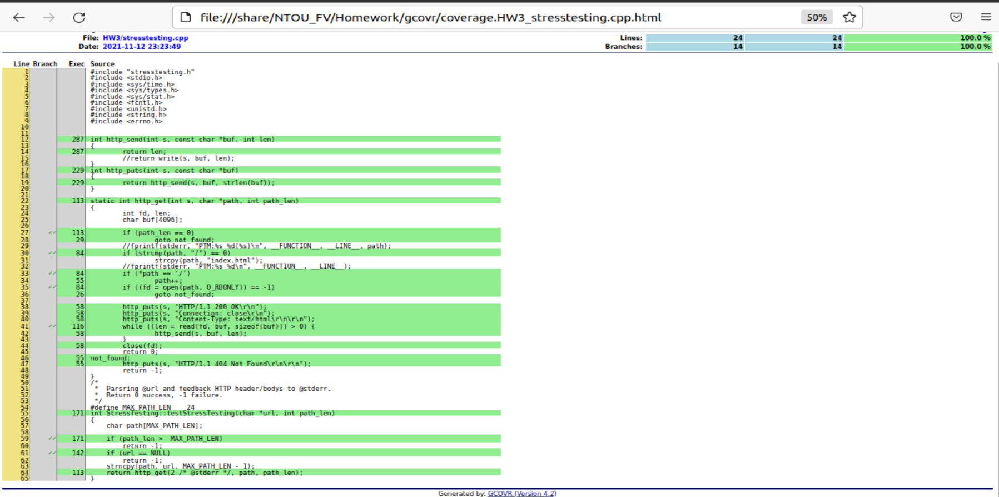

<H1>HW3: Stressing test (2021-11-13)</H1>
[TOC]
---

## 1. Sample Code

```c++

static int http_get(int s, char *path, int path_len)
{
        int fd, len;
        char buf[4096];

        if (path_len == 0)
                goto not_found;
        //fprintf(stderr, "PTM:%s %d(%s)\n", __FUNCTION__, __LINE__, path);
        if (strcmp(path, "/") == 0)
                strcpy(path, "index.html");
        //fprintf(stderr, "PTM:%s %d\n", __FUNCTION__, __LINE__);
        if (*path == '/')
                path++;
        if ((fd = open(path, O_RDONLY)) == -1)
                goto not_found;

        http_puts(s, "HTTP/1.1 200 OK\r\n");
        http_puts(s, "Connection: close\r\n");
        http_puts(s, "Content-Type: text/html\r\n\r\n");
        while ((len = read(fd, buf, sizeof(buf))) > 0) {
                http_send(s, buf, len);
        }
        close(fd);
        return 0;
not_found:
        http_puts(s, "HTTP/1.1 404 Not Found\r\n\r\n");
        return -1;
}
/*
 *  Parsring @url and feedback HTTP header/bodys to @stderr.
 *  Return 0 success, -1 failure.
 */
#define MAX_PATH_LEN    24
int StressTesting::testStressTesting(char *url, int path_len)
{
    char path[MAX_PATH_LEN];

    if (path_len >  MAX_PATH_LEN)
        return -1;
    if (url == NULL)
        return -1;
    strncpy(path, url, MAX_PATH_LEN - 1);
    return http_get(2 /* @stderr */, path, path_len);
}


```
---

## 2. Result of the testing.
### 2-1. Test Cases
```C++
void FormalVerification::HW3_stress_test_data()
{
    struct patten{
        const char *desc;
        const char *path;
        int except;
    } ps [] = {
        {"空指標", NULL, -1},
        {"長度為0", "", -1},
        {"最小輸入", "/", 0},
        {"最大輸入","XXXXXXXXXXXXXXXXXXXXXXXXXX", -1},
        {"有效值","/index.html", 0},
        {"無效值","/unkown.html", -1},
        {NULL, NULL, 0}
    }, *p = ps;


    QTest::addColumn<int>("result");
    QTest::addColumn<int>("except");

    StressTesting http_get;

    for (; p->desc != nullptr; p++) {
        int len = p->path == nullptr ? 0:static_cast<int>(strlen(p->path));
        int ret;

        ret = http_get.testStressTesting((char *)p->path,len);

        QString descriptions = QString("現在測式:(%1), 輸入字串:(%2), 輸入長度(%3), 期望輸出(%4) 實際輸出(%5)")
            .arg(QString(p->desc), +5, QLatin1Char(' '))
            .arg(p->path==nullptr?"null":p->path)
            .arg(len)
            .arg(p->except)
            .arg(ret);
        QTest::newRow(descriptions.toStdString().c_str()) << ret << p->except;
    }
}
void FormalVerification::HW3_stress_test()
{
    QFETCH(int, result);
    QFETCH(int, except);

    QCOMPARE(except,result);
}

QTEST_APPLESS_MAIN(FormalVerification)

```

### 2-2. Result of the test cases.

>Homework $ ./Homework
```
PASS   : FormalVerification::HW3_stress_test(現在測式:(  空指標), 輸入字串:(null), 輸入長度(0), 期望輸出(-1) 實際輸出(-1))
PASS   : FormalVerification::HW3_stress_test(現在測式:( 長度為0), 輸入字串:(), 輸入長度(0), 期望輸出(-1) 實際輸出(-1))
PASS   : FormalVerification::HW3_stress_test(現在測式:( 最小輸入), 輸入字串:(/), 輸入長度(1), 期望輸出(0) 實際輸出(0))
PASS   : FormalVerification::HW3_stress_test(現在測式:( 最大輸入), 輸入字串:(XXXXXXXXXXXXXXXXXXXXXXXXXX), 輸入長度(26), 期望輸出(-1) 實際輸出(-1))
PASS   : FormalVerification::HW3_stress_test(現在測式:(  有效值), 輸入字串:(/index.html), 輸入長度(11), 期望輸出(0) 實際輸出(0))
PASS   : FormalVerification::HW3_stress_test(現在測式:(  無效值), 輸入字串:(/unkown.html), 輸入長度(12), 期望輸出(-1) 實際輸出(-1))
```
--- 
## 3. Report of Test cases.
#### **Stressing Test-case 1: 空指標**
> 1) Input values: 輸入字串:(null), 輸入長度(0)
> 2) expected result(正確的結果): -1
> 3) test program's result: -1
> 4) criteria analysis: 空指標

#### **Stressing Test-case 2: 長度為0**
> 1) Input values: 輸入字串:(""), 輸入長度(0)
> 2) expected result(正確的結果): 0
> 3) test program's result: 0
> 4) criteria analysis: 長度為0

#### **Stressing Test-case 3: 最小輸入**
> 1) Input values: 輸入字串:(/), 輸入長度(1)
> 2) expected result(正確的結果): -1
> 3) test program's result: -1
> 4) criteria analysis: 最小輸入

#### **Stressing Test-case 4: 最大輸入**
> 1) Input values: 輸入字串:(XXXXXXXXXXXXXXXXXXXXXXXXXX), 輸入長度(26)
> 2) expected result(正確的結果): -1
> 3) test program's result: -1
> 4) criteria analysis: 最大輸入

#### **Stressing Test-case 5: 有效值**
> 1) Input values: 輸入字串:(/index.html), 輸入長度(11)
> 2) expected result(正確的結果): 0
> 3) test program's result: 0
> 4) criteria analysis: 有效值

#### **Stressing Test-case 6: 無效值**
> 1) Input values: 輸入字串:(/unkown.html), 輸入長度(12)
> 2) expected result(正確的結果): -1
> 3) test program's result: -1
> 4) criteria analysis: 無效值

---

## 4. Coverage Report


