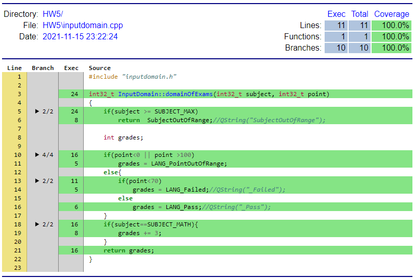

<h1>HW5: Input Domain Characterization </h1> 	

---
[TOC]
---

## 1. Sample Code
```c {.line-numbers}
/**
 * Subject: 0:Lang, 1:Math 
 */
enum SUBJECT{
    SUBJECT_LANG=0,
    SUBJECT_MATH,
    SUBJECT_MAX
};

/**
 *  The excepts
 */
enum EXCEPTS{
    LANG_PointOutOfRange=0,
    LANG_Failed,
    LANG_Pass,
    MATH_PointOutOfRange,
    MATH_Failed,
    MATH_Pass,
    SubjectOutOfRange
};

/**
 * @brief domainOfExams
 * @param subject: 0, 1;
 * @param point: [0~100] 0~69:Failed 70~100:Pass
 * @return
 */
int32_t InputDomain::domainOfExams(int32_t subject, int32_t point)
{
    if(subject >= SUBJECT_MAX)
        return  SubjectOutOfRange;

    int grades;

    if(point<0 || point >100)
        grades = LANG_PointOutOfRange;
    else{
        if(point<70)
            grades = LANG_Failed;
        else
            grades = LANG_Pass;
    }
    if(subject==SUBJECT_MATH){
        grades += 3;
    }
    return grades;
}
```

---
## 2. Flow Chart (略)
```puml
!pragma useVerticalIf on
 note right
 (1)
 end note
if(subject >= SUBJECT_MAX) then (yes)
    :return SubjectOutOfRange;
     note right
    (2)
    end note
end
else (no)
if(point<0 || point >100) then (yes)
    :grades = LANG_PointOutOfRange;
else if(point<70) then (yes)
    :grades = LANG_Failed;
else (no)
    :grades = LANG_Pass;
endif

if(subject==SUBJECT_MATH) then(yes)
    : grades += 3;
endif
:return grades;
end

```

---

## 3. Result of the testing.
### 3-1.Categorization (每個類別)
#### 3-1.1. Test Cases
```c {.line-numbers}
//輸入科目
    int32_t subject[3] ={
        InputDomain::SUBJECT_LANG,
        InputDomain::SUBJECT_MATH,
        InputDomain::SUBJECT_MAX};

//輸入分數
    int32_t points[6] ={-1, 0, 69, 70, 100, 101};

//期待結果
    int32_t categorization_excepts[6]={
        InputDomain::LANG_PointOutOfRange,
        InputDomain::MATH_Failed,
        InputDomain::SubjectOutOfRange,
        InputDomain::LANG_Pass,
        InputDomain::MATH_Pass,
        InputDomain::SubjectOutOfRange};

//測試項目 5-1)	categorization (每個類別)
    for(int32_t i=0; i<6;i++){
        int32_t ret = inputDomain.domainOfExams(subject[i%3],points[i]);

        QString description = QString("5-1)Categorization, input(%1,%2), expect(%3) actual output(%4)")
               .arg(subject[i%3])
               .arg(points[i])
               .arg(categorization_excepts[i])
               .arg(ret);

        QTest::newRow(description.toStdString().c_str())
                << ret
                << categorization_excepts[i];
    }
```

#### 3-1.2. Result of the test cases.
```sh {.line-numbers}
PASS   : Testing::HW5_test(5-1)Categorization, input(0,-1), expect(0) actual output(0))
PASS   : Testing::HW5_test(5-1)Categorization, input(1,0), expect(4) actual output(4))
PASS   : Testing::HW5_test(5-1)Categorization, input(2,69), expect(6) actual output(6))
PASS   : Testing::HW5_test(5-1)Categorization, input(0,70), expect(2) actual output(2))
PASS   : Testing::HW5_test(5-1)Categorization, input(1,100), expect(5) actual output(5))
PASS   : Testing::HW5_test(5-1)Categorization, input(2,101), expect(6) actual output(6))
```

--- 

### 3-2.Combinatorial (各種類別的排列組合)
#### 3-2.1. Test Cases

```c {.line-numbers}
//輸入科目
    int32_t subject[3] = {
        InputDomain::SUBJECT_LANG,
        InputDomain::SUBJECT_MATH,
        InputDomain::SUBJECT_MAX};

//輸入分數
    int32_t points[6] ={-1, 0, 69, 70, 100, 101};

//期待結果
    int32_t combinatorial_excepts[3][6]={
        {
            InputDomain::LANG_PointOutOfRange,
            InputDomain::LANG_Failed,
            InputDomain::LANG_Failed,
            InputDomain::LANG_Pass,
            InputDomain::LANG_Pass,
            InputDomain::LANG_PointOutOfRange
        },
        {
            InputDomain::MATH_PointOutOfRange,
            InputDomain::MATH_Failed,
            InputDomain::MATH_Failed,
            InputDomain::MATH_Pass,
            InputDomain::MATH_Pass,
            InputDomain::MATH_PointOutOfRange
        },
        {
            InputDomain::SubjectOutOfRange,
            InputDomain::SubjectOutOfRange,
            InputDomain::SubjectOutOfRange,
            InputDomain::SubjectOutOfRange,
            InputDomain::SubjectOutOfRange,
            InputDomain::SubjectOutOfRange
        }
    };

//測試項目 5-2)	Combinatorial (各種類別的排列組合)
    for(int32_t i=0; i<3;i++){
        for(int32_t j=0; j<6;j++){
            int32_t ret = inputDomain.domainOfExams(subject[i],points[j]);

            QString description = QString("5-2)Combinatorial, input(%1,%2), expect(%3) actual output(%4)")
                    .arg(subject[i])
                    .arg(points[j])
                    .arg(combinatorial_excepts[i][j])
                    .arg(ret);

                QTest::newRow(description.toStdString().c_str())
                        << ret
                        << combinatorial_excepts[i][j];
        }
    }
```
#### 3-2.2. Result of the test cases.
```sh {.line-numbers}
PASS   : Testing::HW5_test(5-2)Combinatorial, input(0,-1), expect(0) actual output(0))
PASS   : Testing::HW5_test(5-2)Combinatorial, input(0,0), expect(1) actual output(1))
PASS   : Testing::HW5_test(5-2)Combinatorial, input(0,69), expect(1) actual output(1))
PASS   : Testing::HW5_test(5-2)Combinatorial, input(0,70), expect(2) actual output(2))
PASS   : Testing::HW5_test(5-2)Combinatorial, input(0,100), expect(2) actual output(2))
PASS   : Testing::HW5_test(5-2)Combinatorial, input(0,101), expect(0) actual output(0))
PASS   : Testing::HW5_test(5-2)Combinatorial, input(1,-1), expect(3) actual output(3))
PASS   : Testing::HW5_test(5-2)Combinatorial, input(1,0), expect(4) actual output(4))
PASS   : Testing::HW5_test(5-2)Combinatorial, input(1,69), expect(4) actual output(4))
PASS   : Testing::HW5_test(5-2)Combinatorial, input(1,70), expect(5) actual output(5))
PASS   : Testing::HW5_test(5-2)Combinatorial, input(1,100), expect(5) actual output(5))
PASS   : Testing::HW5_test(5-2)Combinatorial, input(1,101), expect(3) actual output(3))
PASS   : Testing::HW5_test(5-2)Combinatorial, input(2,-1), expect(6) actual output(6))
PASS   : Testing::HW5_test(5-2)Combinatorial, input(2,0), expect(6) actual output(6))
PASS   : Testing::HW5_test(5-2)Combinatorial, input(2,69), expect(6) actual output(6))
PASS   : Testing::HW5_test(5-2)Combinatorial, input(2,70), expect(6) actual output(6))
PASS   : Testing::HW5_test(5-2)Combinatorial, input(2,100), expect(6) actual output(6))
PASS   : Testing::HW5_test(5-2)Combinatorial, input(2,101), expect(6) actual output(6))
```
---

## 4. Report of Test cases.
### 4-1.Categorization (每個類別)

#### **Test-case 1: (SUBJECT_LANG, -1)**
|Items|Description|
|----|----|
|Input values|(subject, point)=(SUBJECT_LANG, -1)|
|Expected result|0|
|Test program's result|0|
|Criteria report| 語言科目, 分數輸入錯誤|

#### **Test-case 2: (SUBJECT_MATH, 0)**
|Items|Description|
|----|----|
|Input values|(subject, point)=(SUBJECT_MATH, 0)|
|Expected result|4|
|Test program's result|4|
|Criteria report| 數學科目, 分數不及格|

#### **Test-case 3: (SUBJECT_MAX, 69)**
|Items|Description|
|----|----|
|Input values|(subject, point)=(SUBJECT_MAX, 69)|
|Expected result|6|
|Test program's result|6|
|Criteria report| 無效科目, 分數無須判斷|

#### **Test-case 4: (SUBJECT_LANG, 70)**
|Items|Description|
|----|----|
|Input values|(subject, point)=(SUBJECT_LANG, 70)|
|Expected result|2|
|Test program's result|2|
|Criteria report| 語言科目, 分數及格|

#### **Test-case 5: (SUBJECT_MATH, 100)**
|Items|Description|
|----|----|
|Input values|(subject, point)=(SUBJECT_MATH, 100)|
|Expected result|5|
|Test program's result|5|
|Criteria report| 數學科目, 分數及格|

#### **Test-case 6: (SUBJECT_MAX, 101)**
|Items|Description|
|----|----|
|Input values|(subject, point)=(SUBJECT_MAX, 101)|
|Expected result|6|
|Test program's result|6|
|Criteria report| 無效科目, 分數無須判斷|

---
### 4-2.Combinatorial (各種類別的排列組合)

#### **Test-case 1-1: (SUBJECT_LANG, -1)**
|Items|Description|
|----|----|
|Input values|(SUBJECT_LANG, -1)|
|Expected result|0|
|Test program's result|0|
|Criteria report| 語言科目, 分數超出範圍 |

#### **Test-case 1-2: (SUBJECT_LANG, 0)**
|Items|Description|
|----|----|
|Input values|(SUBJECT_LANG, 0)|
|Expected result|1|
|Test program's result|1|
|Criteria report| 語言科目, 分數不及格 |

#### **Test-case 1-3: (SUBJECT_LANG, 69)**
|Items|Description|
|----|----|
|Input values|(SUBJECT_LANG, 69)|
|Expected result|1|
|Test program's result|1|
|Criteria report| 語言科目, 分數不及格 |

#### **Test-case 1-4: (SUBJECT_LANG, 70)**
|Items|Description|
|----|----|
|Input values|(SUBJECT_LANG, 70)|
|Expected result|2|
|Test program's result|2|
|Criteria report| 語言科目, 分數及格 |

#### **Test-case 1-5: (SUBJECT_LANG, 100)**
|Items|Description|
|----|----|
|Input values|(SUBJECT_LANG, 100)|
|Expected result|2|
|Test program's result|2|
|Criteria report| 語言科目, 分數及格 |

#### **Test-case 1-6: (SUBJECT_LANG, 101)**
|Items|Description|
|----|----|
|Input values|(SUBJECT_LANG, 101)|
|Expected result|0|
|Test program's result|0|
|Criteria report| 語言科目, 分數超出範圍 |


#### **Test-case 2-1: (SUBJECT_MATH, -1)**
|Items|Description|
|----|----|
|Input values|(SUBJECT_MATH, -1)|
|Expected result|3|
|Test program's result|3|
|Criteria report| 數學科目, 分數超出範圍 |

#### **Test-case 2-2: (SUBJECT_MATH, 0)**
|Items|Description|
|----|----|
|Input values|(SUBJECT_LASUBJECT_MATHNG, 0)|
|Expected result|4|
|Test program's result|4|
|Criteria report| 數學科目, 分數不及格 |

#### **Test-case 2-3: (SUBJECT_MATH, 69)**
|Items|Description|
|----|----|
|Input values|(SUBJECT_MATH, 69)|
|Expected result|4|
|Test program's result|4|
|Criteria report| 數學科目, 分數不及格 |

#### **Test-case 2-4: (SUBJECT_MATH, 70)**
|Items|Description|
|----|----|
|Input values|(SUBJECT_LSUBJECT_MATHANG, 70)|
|Expected result|5|
|Test program's result|5|
|Criteria report| 數學科目, 分數及格 |

#### **Test-case 2-5: (SUBJECT_MATH, 100)**
|Items|Description|
|----|----|
|Input values|(SUBJECT_MATH, 100)|
|Expected result|5|
|Test program's result|5|
|Criteria report| 數學科目, 分數及格 |

#### **Test-case 2-6: (SUBJECT_MATH, 101)**
|Items|Description|
|----|----|
|Input values|(SUBJECT_MATH, 101)|
|Expected result|3|
|Test program's result|3|
|Criteria report| 數學科目, 分數超出範圍 |


#### **Test-case 3-1: (SUBJECT_MAX, -1)**
|Items|Description|
|----|----|
|Input values|(SUBJECT_MAX, -1)|
|Expected result|6|
|Test program's result|6|
|Criteria report| 無效科目, 分數無須判斷 |

#### **Test-case 3-2: (SUBJECT_MAX, 0)**
|Items|Description|
|----|----|
|Input values|(SUBJECT_MAX, 0)|
|Expected result|6|
|Test program's result|6|
|Criteria report| 無效科目, 分數無須判斷 |

#### **Test-case 3-3: (SUBJECT_MAX, 69)**
|Items|Description|
|----|----|
|Input values|(SUBJECT_MAX, 69)|
|Expected result|6|
|Test program's result|6|
|Criteria report|無效科目, 分數無須判斷 |

#### **Test-case 3-4: (SUBJECT_MAX, 70)**
|Items|Description|
|----|----|
|Input values|(SUBJECT_MAX, 70)|
|Expected result|6|
|Test program's result|6|
|Criteria report|無效科目, 分數無須判斷 |

#### **Test-case 3-5: (SUBJECT_MAX, 100)**
|Items|Description|
|----|----|
|Input values|(SUBJECT_MAX, 100)|
|Expected result|6|
|Test program's result|6|
|Criteria report| 無效科目, 分數無須判斷 |

#### **Test-case 3-6: (SUBJECT_MAX, 101)**
|Items|Description|
|----|----|
|Input values|(SUBJECT_MAX, 101)|
|Expected result|6|
|Test program's result|6|
|Criteria report| 無效科目, 分數無須判斷 |

---

## 5. Coverage Report

---