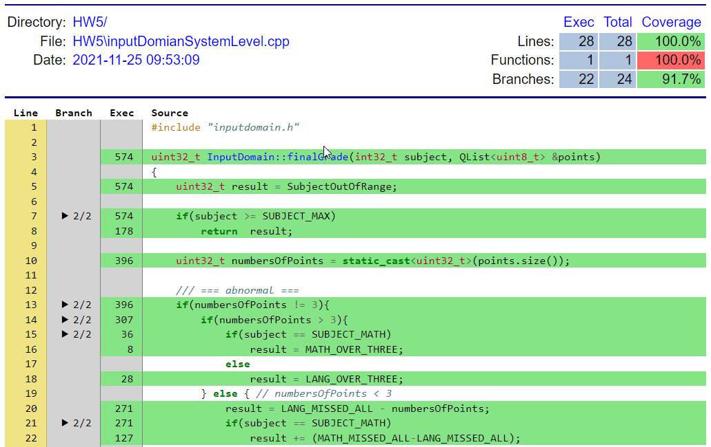
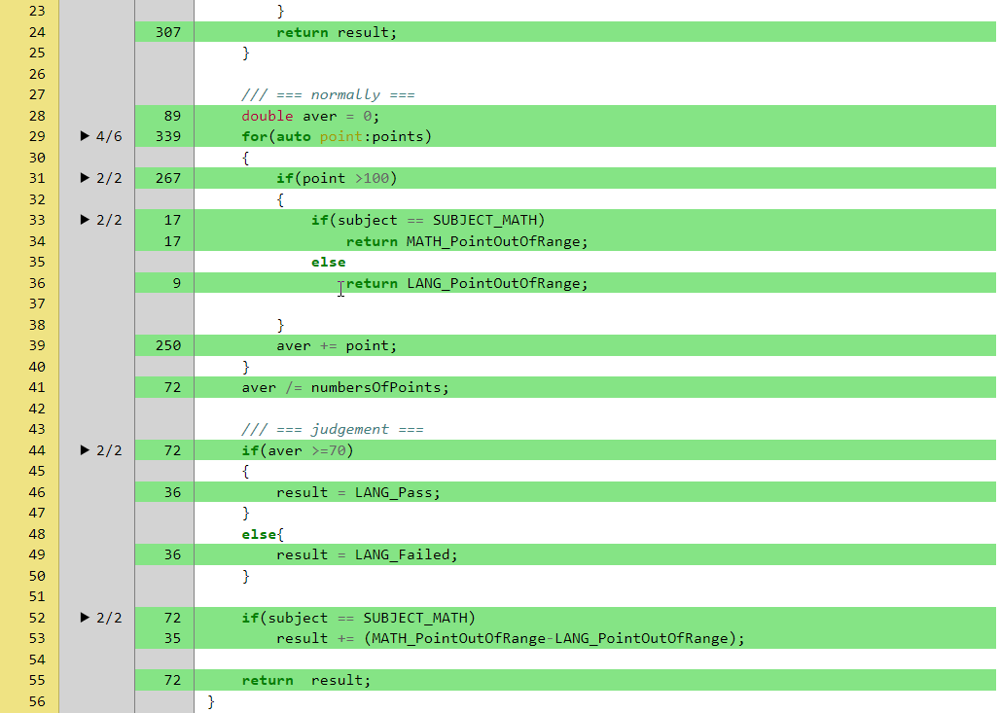

<h1>HW5: Input Domain Characterization </h1> 	

---
[TOC]
---

## 1. Sample Code
```c {.line-numbers}
/**
 * Subject: 0:Lang, 1:Math 
 */
enum SUBJECT{
    SUBJECT_LANG=0,
    SUBJECT_MATH,
    SUBJECT_MAX
};

/**
 *  The excepts
 */
    enum EXCEPTS{
        LANG_PointOutOfRange=0,
        LANG_Failed,
        LANG_Pass,
        MATH_PointOutOfRange,
        MATH_Failed,
        MATH_Pass,
        LANG_MISSED_ONE,
        LANG_MISSED_TWO,
        LANG_MISSED_ALL,
        LANG_OVER_THREE,
        MATH_MISSED_ONE,
        MATH_MISSED_TWO,
        MATH_MISSED_ALL,
        MATH_OVER_THREE,
        SubjectOutOfRange
    };

/**
 * @brief Used to measure the grade.
 * @param subject: 0, 1:
 * @param points[IN]: a list of grade point
 * @return
 */
uint32_t InputDomain::finalGrade(int32_t subject, QList<uint8_t> &points)
{
    uint32_t result = SubjectOutOfRange;

    if(subject >= SUBJECT_MAX)
        return  result;

    uint32_t numbersOfPoints = static_cast<uint32_t>(points.size());

    /// === abnormal ===
    if(numbersOfPoints != 3){
        if(numbersOfPoints > 3){
            if(subject == SUBJECT_MATH)
                result = MATH_OVER_THREE;
            else
                result = LANG_OVER_THREE;
        } else { // numbersOfPoints < 3
            result = LANG_MISSED_ALL - numbersOfPoints;
            if(subject == SUBJECT_MATH)
                result += (MATH_MISSED_ALL-LANG_MISSED_ALL);
        }
        return result;
    }

    /// === normally ===
    double aver = 0;
    for(auto point:points)
    {
        if(point >100)
        {
            if(subject == SUBJECT_MATH)
                return MATH_PointOutOfRange;
            else
                return LANG_PointOutOfRange;

        }
        aver += point;
    }
    aver /= numbersOfPoints;

    /// === judgement ===
    if(aver >=70)
    {
        result = LANG_Pass;
    }
    else{
        result = LANG_Failed;
    }

    if(subject == SUBJECT_MATH)
        result += (MATH_PointOutOfRange-LANG_PointOutOfRange);

    return  result;
}
```

---

## 2. Result of the testing.
### 2-1.Categorization (每個類別)
#### 2-1.1. Test Cases
```c {.line-numbers}
//輸入科目
    int32_t subject[3] = {
        InputDomain::SUBJECT_LANG,
        InputDomain::SUBJECT_MATH,
        InputDomain::SUBJECT_MAX};

//輸入分數
    QList<uint8_t> points[7];
    points[0].clear();  // lang
    points[1]={10};     //math
    points[2]={10,20};  // max
    points[3]={10,20,30};   //lang
    points[4]={80,90,100};  // math
    points[5]={90,100,110}; // max
    points[6]={1,2,3,4,5};  // lang
//期待結果
    uint32_t categorization_excepts[7]={
        InputDomain::LANG_MISSED_ALL,
        InputDomain::MATH_MISSED_TWO,
        InputDomain::SubjectOutOfRange,
        InputDomain::LANG_Failed,
        InputDomain::MATH_Pass,
        InputDomain::SubjectOutOfRange,
        InputDomain::LANG_OVER_THREE
    };

//測試項目 5-1)	categorization (每個類別)
    for(int32_t i=0; i<7;i++){
        uint32_t ret = inputDomain.finalGrade(i%3,points[i]);

        QString description = QString("5-1)%1 Categorization, subject(%2), output(%3) expect(%4)")
                .arg(i)
               .arg(i%3)
               .arg(categorization_excepts[i])
               .arg(ret);

        QTest::newRow(description.toStdString().c_str())
                << ret
                << categorization_excepts[i];
    }
```

#### 2-1.2. Result of the test cases.
```sh {.line-numbers}
PASS   : Testing::HW5_system(5-1)1 Categorization, subject(0), output(8) expect(8))
PASS   : Testing::HW5_system(5-1)2 Categorization, subject(1), output(11) expect(11))
PASS   : Testing::HW5_system(5-1)3 Categorization, subject(2), output(14) expect(14))
PASS   : Testing::HW5_system(5-1)4 Categorization, subject(0), output(1) expect(1))
PASS   : Testing::HW5_system(5-1)5 Categorization, subject(1), output(5) expect(5))
PASS   : Testing::HW5_system(5-1)6 Categorization, subject(2), output(14) expect(14))
PASS   : Testing::HW5_system(5-1)7 Categorization, subject(0), output(9) expect(9))
```

--- 

### 2-2.Combinatorial (各種類別的排列組合)
#### 2-2.1. Test Cases

```c {.line-numbers}
//輸入科目
    int32_t subject[3] = {
        InputDomain::SUBJECT_LANG,
        InputDomain::SUBJECT_MATH,
        InputDomain::SUBJECT_MAX};

//輸入分數
    QList<uint8_t> points[7];
    points[0].clear();  // lang
    points[1]={10};  //math
    points[2]={10,20}; // max
    points[3]={10,20,30}; //lang
    points[4]={80,90,100}; // math
    points[5]={90,100,110}; // max
    points[6]={1,2,3,4,5}; // lang

//期待結果
    uint32_t combinatorial_excepts[3][7]={
        {
            InputDomain::LANG_MISSED_ALL,
            InputDomain::LANG_MISSED_TWO,
            InputDomain::LANG_MISSED_ONE,
            InputDomain::LANG_Failed,
            InputDomain::LANG_Pass,
            InputDomain::LANG_PointOutOfRange,
            InputDomain::LANG_OVER_THREE
        },
        {
            InputDomain::MATH_MISSED_ALL,
            InputDomain::MATH_MISSED_TWO,
            InputDomain::MATH_MISSED_ONE,
            InputDomain::MATH_Failed,
            InputDomain::MATH_Pass,
            InputDomain::MATH_PointOutOfRange,
            InputDomain::MATH_OVER_THREE
        },
        {
            InputDomain::SubjectOutOfRange,
            InputDomain::SubjectOutOfRange,
            InputDomain::SubjectOutOfRange,
            InputDomain::SubjectOutOfRange,
            InputDomain::SubjectOutOfRange,
            InputDomain::SubjectOutOfRange,
            InputDomain::SubjectOutOfRange
        }
    };

//測試項目 5-2)	Combinatorial (各種類別的排列組合)
    for(int32_t i=0; i<3;i++){
        for(int32_t j=0; j<7;j++){
            uint32_t ret = inputDomain.finalGrade(i,points[j]);

            QString description = QString("5-2)Combinatorial, subject(%1), output(%2)  expect(%3)")
                    .arg(i)
                    .arg(ret)
                    .arg(combinatorial_excepts[i][j]);

                QTest::newRow(description.toStdString().c_str())
                        << ret
                        << combinatorial_excepts[i][j];
        }
    }
```
#### 2-2.2. Result of the test cases.
```sh {.line-numbers}
PASS   : Testing::HW5_system(5-2)1 Combinatorial, subject(0), output(8)  expect(8))
PASS   : Testing::HW5_system(5-2)2 Combinatorial, subject(0), output(7)  expect(7))
PASS   : Testing::HW5_system(5-2)3 Combinatorial, subject(0), output(6)  expect(6))
PASS   : Testing::HW5_system(5-2)4 Combinatorial, subject(0), output(1)  expect(1))
PASS   : Testing::HW5_system(5-2)5 Combinatorial, subject(0), output(2)  expect(2))
PASS   : Testing::HW5_system(5-2)6 Combinatorial, subject(0), output(0)  expect(0))
PASS   : Testing::HW5_system(5-2)7 Combinatorial, subject(0), output(9)  expect(9))
PASS   : Testing::HW5_system(5-2)8 Combinatorial, subject(1), output(12)  expect(12))
PASS   : Testing::HW5_system(5-2)9 Combinatorial, subject(1), output(11)  expect(11))
PASS   : Testing::HW5_system(5-2)10 Combinatorial, subject(1), output(10)  expect(10))
PASS   : Testing::HW5_system(5-2)11 Combinatorial, subject(1), output(4)  expect(4))
PASS   : Testing::HW5_system(5-2)12 Combinatorial, subject(1), output(5)  expect(5))
PASS   : Testing::HW5_system(5-2)13 Combinatorial, subject(1), output(3)  expect(3))
PASS   : Testing::HW5_system(5-2)14 Combinatorial, subject(1), output(13)  expect(13))
PASS   : Testing::HW5_system(5-2)15 Combinatorial, subject(2), output(14)  expect(14))
PASS   : Testing::HW5_system(5-2)16 Combinatorial, subject(2), output(14)  expect(14))
PASS   : Testing::HW5_system(5-2)17 Combinatorial, subject(2), output(14)  expect(14))
PASS   : Testing::HW5_system(5-2)18 Combinatorial, subject(2), output(14)  expect(14))
PASS   : Testing::HW5_system(5-2)19 Combinatorial, subject(2), output(14)  expect(14))
PASS   : Testing::HW5_system(5-2)20 Combinatorial, subject(2), output(14)  expect(14))
PASS   : Testing::HW5_system(5-2)21 Combinatorial, subject(2), output(14)  expect(14))
```
---

## 3. Report of Test cases.
### 3-1.Categorization (每個類別)

#### **Test-case 1: (SUBJECT_LANG, {empty})**
|Items|Description|
|----|----|
|Input values|(SUBJECT_LANG, [empty]})|
|Expected result|8|
|Test program's result|8|
|Domain Characteristics | 語言科目全缺考(LANG_MISSED_ALL) |

#### **Test-case 2: (SUBJECT_MATH, [10])**
|Items|Description|
|----|----|
|Input values|(SUBJECT_MATH, [10])|
|Expected result|11|
|Test program's result|11|
|Domain Characteristics| 數學科目缺考兩次(MATH_MISSED_TWO)|

#### **Test-case 3: (SUBJECT_MAX, [10,20])**
|Items|Description|
|----|----|
|Input values|(SUBJECT_MAX, [10,20])|
|Expected result|14|
|Test program's result|14|
|Domain Characteristics| 無效科目(SubjectOutOfRange) |

#### **Test-case 4: (SUBJECT_LANG, [10,20,30])**
|Items|Description|
|----|----|
|Input values|(SUBJECT_LANG, [10,20,30])|
|Expected result|1|
|Test program's result|1|
|Domain Characteristics| 語言科目不及格(LANG_Failed)|

#### **Test-case 5: (SUBJECT_MATH, [80,90,100])**
|Items|Description|
|----|----|
|Input values|(SUBJECT_MATH, [80,90,100])|
|Expected result|5|
|Test program's result|5|
|Domain Characteristics| 數學科目及格(MATH_Pass)|
  
#### **Test-case 6: (SUBJECT_MAX, [90,100,110])**
|Items|Description|
|----|----|
|Input values|(SUBJECT_MAX, [90,100,110])|
|Expected result|14|
|Test program's result|14|
|Domain Characteristics| 無效科目(SubjectOutOfRange)|

#### **Test-case 7: (SUBJECT_LANG, [1,2,3,4,5])**
|Items|Description|
|----|----|
|Input values|(subject, point)=(SUBJECT_LANG, [1,2,3,4,5])|
|Expected result|9|
|Test program's result|9|
|Domain Characteristics| 語言科目輸入超過(LANG_OVER_THREE)|
---
### 3-2.Combinatorial (各種類別的排列組合)

#### **Test-case 1-1: (SUBJECT_LANG, [empty])**
|Items|Description|
|----|----|
|Input values|(SUBJECT_LANG, [empty])|
|Expected result|8|
|Test program's result|8|
|Domain Characteristics| 語言科目全缺考(LANG_MISSED_ALL) |

#### **Test-case 1-2: (SUBJECT_LANG, [10])**
|Items|Description|
|----|----|
|Input values|(SUBJECT_LANG, [10])|
|Expected result|7|
|Test program's result|7|
|Domain Characteristics| 語言科目缺考2次(LANG_MISSED_TWO) |

#### **Test-case 1-3: (SUBJECT_LANG, [10,20])**
|Items|Description|
|----|----|
|Input values|(SUBJECT_LANG, [10,20])|
|Expected result|6|
|Test program's result|6|
|Domain Characteristics| 語言科目缺考1次(LANG_MISSED_ONE) |

#### **Test-case 1-4: (SUBJECT_LANG, [10,20,30])**
|Items|Description|
|----|----|
|Input values|(SUBJECT_LANG, [10,20,30])|
|Expected result|1|
|Test program's result|1|
|Domain Characteristics| 語言科目不及格(LANG_Failed) |

#### **Test-case 1-5: (SUBJECT_LANG, [80,90,100])**
|Items|Description|
|----|----|
|Input values|(SUBJECT_LANG, [80,90,100])|
|Expected result|2|
|Test program's result|2|
|Domain Characteristics| 語言科目及格(LANG_Pass) |

#### **Test-case 1-6: (SUBJECT_LANG, [90,100,110])**
|Items|Description|
|----|----|
|Input values|(SUBJECT_LANG, [90,100,110])|
|Expected result|0|
|Test program's result|0|
|Domain Characteristics| 語言科目分數輸入錯誤(LANG_PointOutOfRange) |

#### **Test-case 1-7: (SUBJECT_LANG, [1,2,3,4,5])**
|Items|Description|
|----|----|
|Input values|(SUBJECT_LANG, [1,2,3,4,5])|
|Expected result|9|
|Test program's result|9|
|Domain Characteristics| 語言科目輸入超過(LANG_OVER_THREE) |


#### **Test-case 2-1: (SUBJECT_MATH, [empty])**
|Items|Description|
|----|----|
|Input values|(SUBJECT_LANG, [empty])|
|Expected result|12|
|Test program's result|12|
|Domain Characteristics| 數學科目全缺考(MATH_MISSED_ALL) |

#### **Test-case 2-2: (SUBJECT_MATH, [10])**
|Items|Description|
|----|----|
|Input values|(SUBJECT_LANG, [10])|
|Expected result|11|
|Test program's result|11|
|Domain Characteristics| 數學科目缺考2次(MATH_MISSED_TWO) |

#### **Test-case 2-3: (SUBJECT_MATH, [10,20])**
|Items|Description|
|----|----|
|Input values|(SUBJECT_LANG, [10,20])|
|Expected result|10|
|Test program's result|10|
|Domain Characteristics| 數學科目缺考1次(MATH_MISSED_ONE) |

#### **Test-case 2-4: (SUBJECT_MATH, [10,20,30])**
|Items|Description|
|----|----|
|Input values|(SUBJECT_LANG, [10,20,30])|
|Expected result|4|
|Test program's result|4|
|Domain Characteristics| 數學科目不及格(MATH_Failed) |

#### **Test-case 2-5: (SUBJECT_MATH, [80,90,100])**
|Items|Description|
|----|----|
|Input values|(SUBJECT_LANG, [80,90,100])|
|Expected result|5|
|Test program's result|5|
|Domain Characteristics| 數學科目及格(MATH_Pass) |

#### **Test-case 2-6: (SUBJECT_MATH, [90,100,110])**
|Items|Description|
|----|----|
|Input values|(SUBJECT_LANG, [90,100,110])|
|Expected result|3|
|Test program's result|3|
|Domain Characteristics| 數學科目分數輸入錯誤(MATH_PointOutOfRange) |

#### **Test-case 2-7: (SUBJECT_MATH, [1,2,3,4,5])**
|Items|Description|
|----|----|
|Input values|(SUBJECT_LANG, [1,2,3,4,5])|
|Expected result|13|
|Test program's result|13|
|Domain Characteristics| 數學科目輸入超過(MATH_OVER_THREE) |


#### **Test-case 3-1: (SUBJECT_MAX, [empty])**
|Items|Description|
|----|----|
|Input values|(SUBJECT_LANG, [empty])|
|Expected result|14|
|Test program's result|14|
|Domain Characteristics| 無效科目(SubjectOutOfRange) |

#### **Test-case 3-2: (SUBJECT_MAX, [10])**
|Items|Description|
|----|----|
|Input values|(SUBJECT_LANG, [10])|
|Expected result|14|
|Test program's result|14|
|Domain Characteristics| 無效科目(SubjectOutOfRange) |

#### **Test-case 3-3: (SUBJECT_MAX, [10,20])**
|Items|Description|
|----|----|
|Input values|(SUBJECT_LANG, [10,20])|
|Expected result|14|
|Test program's result|14|
|Domain Characteristics| 無效科目(SubjectOutOfRange) |

#### **Test-case 3-4: (SUBJECT_MAX, [10,20,30])**
|Items|Description|
|----|----|
|Input values|(SUBJECT_LANG, [10,20,30])|
|Expected result|14|
|Test program's result|14|
|Domain Characteristics| 無效科目(SubjectOutOfRange) |

#### **Test-case 3-5: (SUBJECT_MAX, [80,90,100])**
|Items|Description|
|----|----|
|Input values|(SUBJECT_LANG, [80,90,100])|
|Expected result|14|
|Test program's result|14|
|Domain Characteristics| 無效科目(SubjectOutOfRange) |

#### **Test-case 3-6: (SUBJECT_MAX, [90,100,110])**
|Items|Description|
|----|----|
|Input values|(SUBJECT_LANG, [90,100,110])|
|Expected result|14|
|Test program's result|14|
|Domain Characteristics| 無效科目(SubjectOutOfRange) |

#### **Test-case 3-7: (SUBJECT_MAX, [1,2,3,4,5])**
|Items|Description|
|----|----|
|Input values|(SUBJECT_LANG, [1,2,3,4,5])|
|Expected result|14|
|Test program's result|14|
|Domain Characteristics| 無效科目(SubjectOutOfRange) |

---

## 4. Coverage Report


---