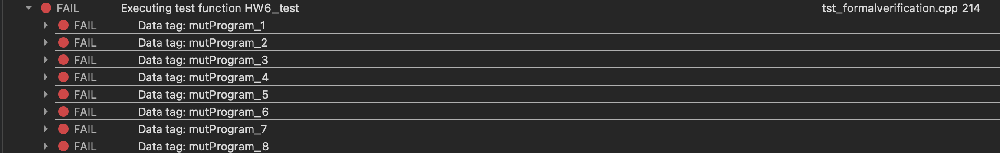

<h1>HW6: Mutation test </h1> 	

[TOC]

---
## 1. Sample Code
```c++ {.line-numbers}
int Mutations::orgProgram(int inputNumber)
{
    int result = 0; //1
    if(1<= inputNumber and inputNumber <= 10){  //2
        for(int i=1; i<=inputNumber; ++i){  //3,4,5
            result +=i; //6
        }
        return result;  //7
    }
    return -1;  //8
}

int Mutations::mutProgram_1(int inputNumber)
{
    int result = 10;    //#1    0 -> 10
    if(1<= inputNumber and inputNumber <= 10){
        for(int i=1; i<=inputNumber; ++i){
            result +=i;
        }
        return result;
    }
    return -1;
}
int Mutations::mutProgram_2(int inputNumber)
{
    int result = 0;
    //#2 and -> or
    if(1<= inputNumber or inputNumber <= 10){ 
        for(int i=1; i<=inputNumber; ++i){
            result +=i;
        }
        return result;
    }
    return -1;
}
int Mutations::mutProgram_3(int inputNumber)
{
    int result = 0;
    if(1<= inputNumber and inputNumber <= 10){
        //#3 1 -> 10
        for(int i=10; i<=inputNumber; ++i){  
            result +=i;
        }
        return result;
    }
    return -1;
}
int Mutations::mutProgram_4(int inputNumber) 
//inputNumber = 4
{
    int result = 0;
    if(1<= inputNumber and inputNumber <= 10){
        //#4 <= -> <
        for(int i=1; i<inputNumber; ++i){  
            result +=i;
        }
        return result;  //1+2+3
    }
    return -1;
}
int Mutations::mutProgram_5(int inputNumber)
{
    int result = 0;
    if(1<= inputNumber and inputNumber <= 10){  
        //#5    ++i -> i=i+2
        for(int i=1; i<=inputNumber; i=i+2){  
            result +=i;
        }
        return result;  //
    }
    return -1;
}
int Mutations::mutProgram_6(int inputNumber)
{
    int result = 0;
    if(1<= inputNumber and inputNumber <= 10){
        for(int i=1; i<=inputNumber; ++i){
            //#6    i -> inputNumber
            result +=inputNumber; 
        }
        return result;
    }
    return -1;
}
int Mutations::mutProgram_7(int inputNumber)
{
    int result = 0;
    if(1<= inputNumber and inputNumber <= 10){
        for(int i=1; i<=inputNumber; ++i){
            result +=i;
        } //#7    result -> inputNumber
        return inputNumber;  
    }
    return -1;
}
int Mutations::mutProgram_8(int inputNumber)
{
    int result = 0;
    if(1<= inputNumber and inputNumber <= 10){
        for(int i=1; i<=inputNumber; ++i){
            result +=i;
        }
        return result;
    }
    return inputNumber;  //#8 -1 -> inputNumber
}
```

---

## 2. Result of the testing.
```
********* Start testing of Testing *********
Config: Using QtTest library 6.2.0, Qt 6.2.0 (arm64-little_endian-lp64 shared (dynamic) release build; by Clang 12.0.5 (clang-1205.0.22.11) (Apple)), macos 11.6
FAIL!  : Testing::HW6_test(mutProgram_1) Compared values are not the same
   Actual   (except): 1
   Expected (result): 11
   Loc: [../Homework/tst_formalverification.cpp(219)]
FAIL!  : Testing::HW6_test(mutProgram_2) Compared values are not the same
   Actual   (except): -1
   Expected (result): 0
   Loc: [../Homework/tst_formalverification.cpp(219)]
FAIL!  : Testing::HW6_test(mutProgram_3) Compared values are not the same
   Actual   (except): 10
   Expected (result): 0
   Loc: [../Homework/tst_formalverification.cpp(219)]
FAIL!  : Testing::HW6_test(mutProgram_4) Compared values are not the same
   Actual   (except): 10
   Expected (result): 6
   Loc: [../Homework/tst_formalverification.cpp(219)]
FAIL!  : Testing::HW6_test(mutProgram_5) Compared values are not the same
   Actual   (except): 10
   Expected (result): 4
   Loc: [../Homework/tst_formalverification.cpp(219)]
FAIL!  : Testing::HW6_test(mutProgram_6) Compared values are not the same
   Actual   (except): 10
   Expected (result): 16
   Loc: [../Homework/tst_formalverification.cpp(219)]
FAIL!  : Testing::HW6_test(mutProgram_7) Compared values are not the same
   Actual   (except): 10
   Expected (result): 4
   Loc: [../Homework/tst_formalverification.cpp(219)]
FAIL!  : Testing::HW6_test(mutProgram_8) Compared values are not the same
   Actual   (except): -1
   Expected (result): 0
   Loc: [../Homework/tst_formalverification.cpp(219)]
Totals: 0 passed, 8 failed, 0 skipped, 0 blacklisted, 0ms
********* Finished testing of Testing *********
```
 
---

## 3. Report of Test cases.
#### **Ｍutation Test-case 1:**
1. Input values: inputNumber 1
2. expected result: 1
3. test origiol program-s result: 1
4. test mutant program's result: 11
#### **Ｍutation Test-case 2:**
1. Input values: inputNumber 0
2. expected result: -1
33. test origiol program-s result: -1
4. test mutant program's result: 0
#### **Ｍutation Test-case 3:**
1. Input values: inputNumber 4
2. expected result: 10
3. test origiol program-s result: 10
4. test mutant program's result: 0
#### **Ｍutation Test-case 4:**
1. Input values: inputNumber 4
2. expected result: 10
3. test origiol program-s result: 10
4. test mutant program's result: 16
#### **Ｍutation Test-case 5:**
1. Input values: inputNumber 4
2. expected result: 10
3. test origiol program-s result: 10
4. test mutant program's result: 6
#### **Ｍutation Test-case 6:**
1. Input values: inputNumber 4
2. expected result: 10
3. test origiol program-s result: 10
4. test mutant program's result: 4
#### **Ｍutation Test-case 7:**
1. Input values: inputNumber 4
2. expected result: 10
3. test origiol program-s result: 10
4. test mutant program's result: 4
#### **Ｍutation Test-case 8:**
1. Input values: inputNumber 0
2. expected result: -1
3. test origiol program-s result: -1
4. test mutant program's result: 0

---