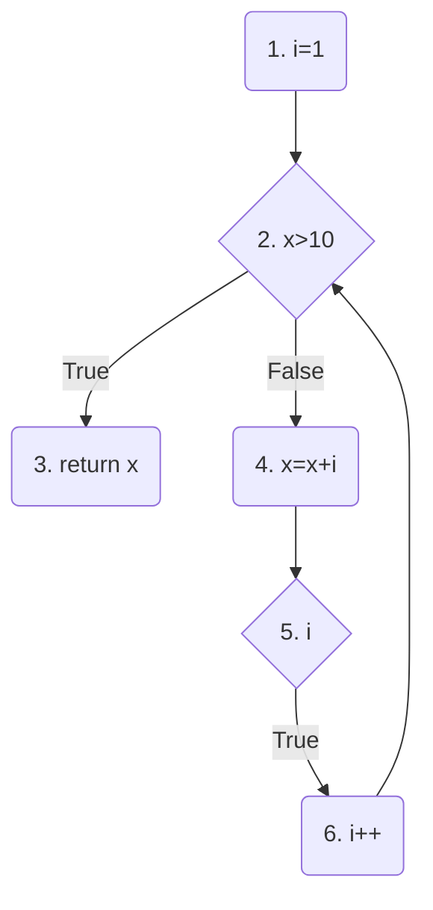
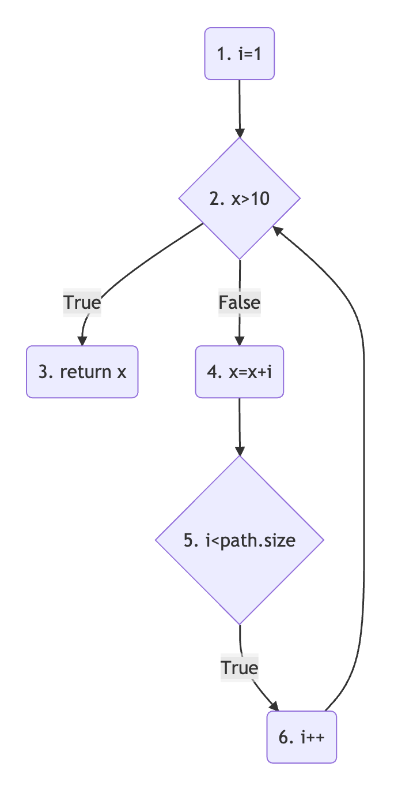

# 軟體正規方法-期末考
### 1.導出沒小括弧的敘述
¬(p∧q∨¬r)
> ¬p∨¬q∧r

### 2.使用 Predicate Calculus 敘述出
There is exactly one person who loves everybody.
> ∃x∀yL(x,y)

### 3.使用 Predicate Calculus 敘述出
Paul Erdős is the famous mathematician who loved only numbers.
> Let
> L(a,b) denote the propositional function “a loves b.”
> F(x) be the statement: "x is famous"
> M(x) be the statement: "x is a mathematician"
> F(Paul Erdős) ∧ M(Paul Erdős) ∧ L(Paul Erdős,numbers) ∧ ∀x(x=numbers∨¬L(Paul Erdős,x))

### 4.使用中文解釋下面Predicate Calculus的敘述
Let T(a,b) denote the propositional function “a trusts b.”
Let U be the set of all people in the world.
a. ∀x∃y T(x,y)
> a. 所有人相信某個人

b. ∀x∃y T(y,x)
> 所有人被某個人相信著

c. ∃x∀y T(x,y)
> 某個人相信所有人

d. ∃x∀y T(y,x)
> 某個人被所有人相信著

### 5.寫出與敘述相同意思的另外兩種敘述
¬∀x∃y T(x,y)
> 0.沒有一個人相信某些人 no one trusts somebody
> 1.∃y∀x¬T(x,y) smoebody is not trusted by everyone
> 2.


### 6.論證下面說法是正確或錯誤
"一天吃2餐、睡7小時、所以我不是權貴"
>

### 7.詳細說明
a. Black-Box testing
> That is, testing that does not look at source code or internal structure of the system.

b. White-Box testing
> Use source code (or other structure beyond the input/output spec.) to design test cases

c. 什麼是成功的testing
> A successful test is one that finds an error.

### 8.詳細說明
a. Unit testing
> Unit testing is the first phase, done by developers of modules.

b. Integration testing
> Integration testing combines unit tested modules and tests how they interact.

c. System testing
> System testing tests a whole program to make sure it meets requirements.

### 9.寫出有100% coverage的最少test cases
```c++
if (x == y || x < z)
    z = x - y;
else
   z = 2 * x;
```
a. Predicate Coverage
> <b>test case 1</b>
> Input Valuse: x=1, y=1, z=2
> Expected Result: True
> Criteria Analysis:(x == y || x < z), True
> <b>test case 2</b>
> Input Valuse: x=1, y=2, z=0
> Expected Result: False
> Criteria Analysis:(x == y || x < z), False

b. Clause Coverage
> <b>test case 1</b>
> Input Valuse: x=1, y=1, z=2
> Expected Result: True
> Criteria Analysis: x == y, True; x < z, True
> <b>test case 2</b>
> Input Valuse: x=1, y=2, z=0
> Expected Result: False
> Criteria Analysis:x == y, Flase; x < z, False

### 10.
```c++
for (i=1; i < path.size(); i++)
	if (x >10)
		return x;
	else
		x = x + i;
```
1. 畫出 Control Flow Graph (流程圖)


1. 寫出有100% coverage的 test cases
> Input Values: x=10, path.size()=6
> Expected Result: 11
> Test Program's Result: 11
> Criteria Analysis: 
> > a. Edge Coverage
> > (1,2),(2,3),(2,4),(4,5),(5,6),(6,2)
> > b. Edge-Pair Coverage
> > (1,2,3),(1,2,4),(2,4,5),(4,5,6),(6,2,3),(6,2,4)
> > c. Test Path Coverage
> > (1,2,3),(1,2,4,5,6,2,3) 
